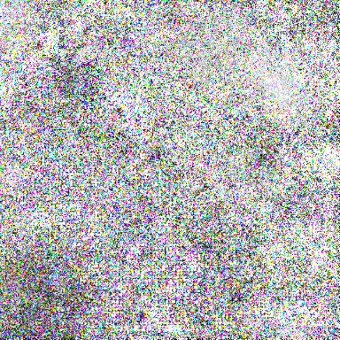

# PyTorch Adversarial Attack Generator

A comprehensive library for generating adversarial examples to confuse state-of-the-art deep learning models using different attack methods.


|  |  |  |
| :---------------------------------------: | :---------------------------------------: | :----------------------------------------: |
|           **Proboscis Monkey**            |           **Adversarial Noise**           |              **Dining Table**              |


## Overview

This library implements various adversarial attack methods to generate examples that can confuse image classification models. It includes attacks targeted at both Convolutional Neural Networks (CNNs) and Vision Transformers.

## Supported Attacks

- **CW** (Carlini & Wagner Attack) [Towards Evaluating the Robustness of Neural Networks](https://arxiv.org/abs/1608.04644)
- **FGM** (Fast Gradient Method) [Explaining and Harnessing Adversarial Examples](https://arxiv.org/abs/1412.6572)
- **PGD** (Projected Gradient Descent) [Towards Deep Learning Models Resistant to Adversarial Attacks](https://arxiv.org/abs/1706.06083)
- **TGR** (Token Gradient Regularization Attack) [Transferable Adversarial Attacks on Vision Transformers With Token Gradient Regularization](https://arxiv.org/abs/2301.11929)

## Supported Models

### Vision Transformers
- ViT-H-14 [An Image is Worth 16x16 Words: Transformers for Image Recognition at Scale](https://arxiv.org/abs/2010.11929)
- ViT-L-16 [An Image is Worth 16x16 Words: Transformers for Image Recognition at Scale](https://arxiv.org/abs/2010.11929)

### CNN Architectures
- RegNet-Y-128GF [Designing Network Design Spaces](https://arxiv.org/abs/2003.13678)
- EfficientNetV2-L [EfficientNetV2: Smaller Models and Faster Training](https://arxiv.org/abs/2104.00298)
- ConvNeXt-Large [A ConvNet for the 2020s](https://arxiv.org/abs/2201.03545)
- Swin-V2-B [Swin Transformer V2: Scaling Up Capacity and Resolution](https://arxiv.org/abs/2111.09883)
- MaxViT-T [MaxViT: Multi-Axis Vision Transformer](https://arxiv.org/abs/2204.01697)
- ResNeXt101-64x4d [Aggregated Residual Transformations for Deep Neural Networks](https://arxiv.org/abs/1611.05431)
- ResNet50-V2 [Identity Mappings in Deep Residual Networks](https://arxiv.org/abs/1603.05027)

## Usage

### Using `uv`

```bash
uv run adversarial-attack --model_name regnet_y_128gf --input_image ../adversarial_attack_generar/assets/input.png --output_path output/ --target_class 532 --attack_method TGR
```

### Using `python`

```python
python main.py --model_name regnet_y_128gf --input_image ../adversarial_attack_generator/assets/input.png --output_path output/ --target_class 532 --attack_method TGR
```

## Adding Custom Models

To add new PyTorch pretrained models:

1. Add the model name and weights  from <https://pytorch.org/vision/main/models.html> to the `SUPPORTED_MODELS` dictionary in `model.py`.


## References

1. [adversarial-robustness-toolbox](https://adversarial-robustness-toolbox.readthedocs.io/en/latest/index.html)
2. [Token Gradient Regularization](https://github.com/jpzhang1810/TGR)
3. [PyTorch Models and pre-trained weights](https://pytorch.org/vision/main/models.html)

